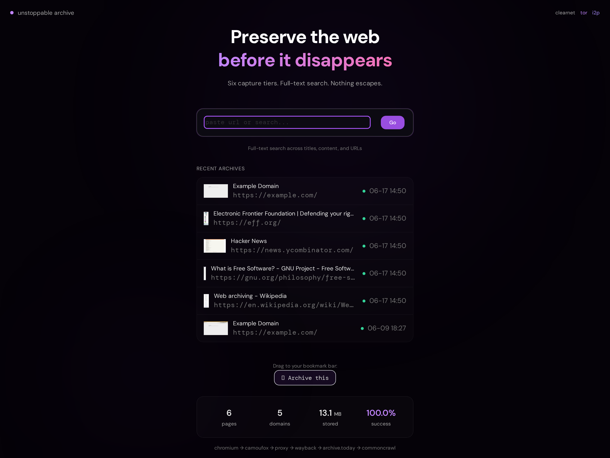
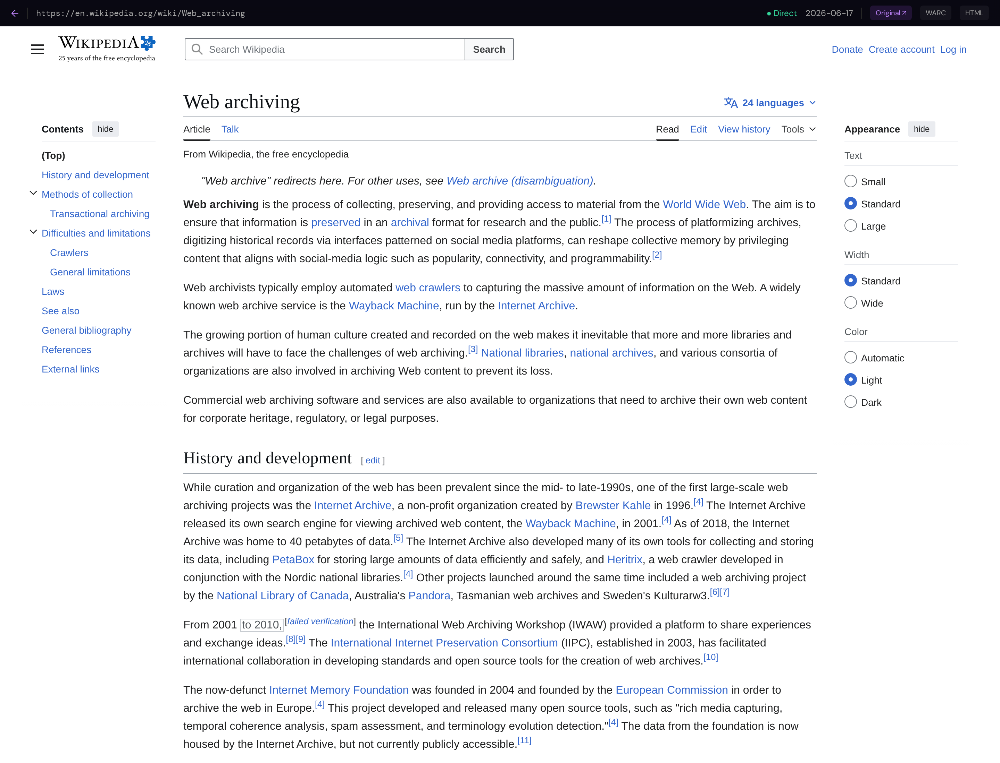
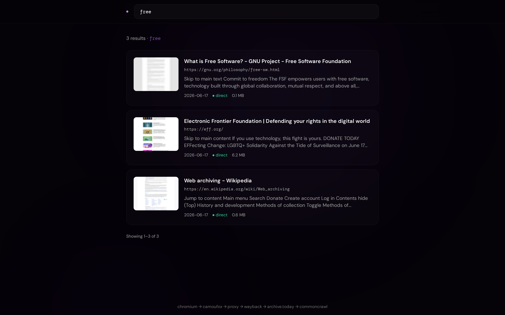
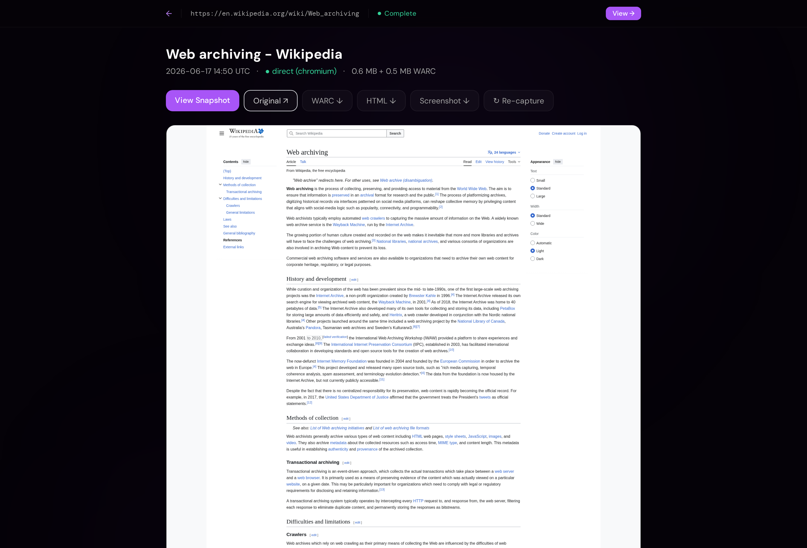
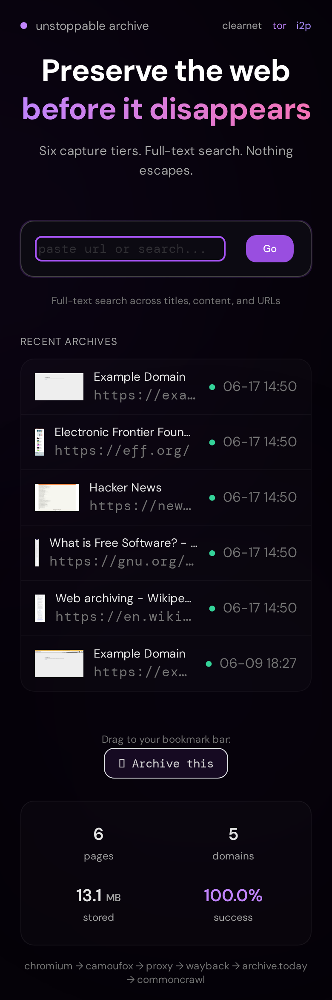

# Unstoppable Archive

[](https://unlicense.org/)
[](https://www.python.org/downloads/)
[](https://www.postgresql.org/)
[](https://github.com/19-84/unstoppable-archiver/actions/workflows/ci.yml)
[](https://microsoft.github.io/pyright/)
[](https://codeberg.org/19-84/unstoppable-archiver)
[](https://gitgud.io/1984/unstoppable-archiver)

> **Preserve the web before it disappears.** A self-hosted web archiver that
> captures any page as a self-contained HTML snapshot **+** WARC **+**
> screenshot, and refuses to take "no" for an answer — when a site blocks the
> bots, it escalates through eight capture tiers until something gets through.

If you find this useful, consider giving it a star on GitHub — it helps others
discover the project.

**[Documentation](#documentation)** · [Self-hosted setup](#self-hosted--run-it-for-yourself) · [Public deployment](#public-deployment--run-it-for-others) · [How capture works](#how-capture-works) · [Architecture](#architecture)

---

## Why

Links rot. Communities get banned, paywalls slam shut, articles get quietly
edited or deleted, and the "just use the Wayback Machine" answer fails the
moment a site serves Cloudflare's challenge page to anything that looks like a
crawler. Unstoppable Archive is built for the pages that *don't want* to be
archived: it presents as a real browser, rotates fingerprints and proxies,
falls back to public archives, and only gives up after eight escalating
strategies have all failed.

Every capture produces a **self-contained snapshot** — all CSS inlined, all
images as data URIs, scripts stripped, no external requests — so the archive
keeps rendering correctly years after the original is gone.

## Documentation

| | |
|---|---|
| **[How capture works](#how-capture-works)** | The eight-tier escalation pipeline |
| **[Architecture](#architecture)** | Components, data flow, storage |
| [docs/tls.md](docs/tls.md) | TLS / reverse-proxy setup |
| [docs/backups.md](docs/backups.md) | Scheduled `pg_dump` + artifact backups |
| [docs/observability.md](docs/observability.md) | Prometheus + Grafana metrics |
| [CONTRIBUTING.md](CONTRIBUTING.md) | Development workflow and quality gates |
| [SECURITY.md](SECURITY.md) | Security policy and reporting |
| [CHANGELOG.md](CHANGELOG.md) | Release notes |
| [CODE_OF_CONDUCT.md](CODE_OF_CONDUCT.md) | Community guidelines |

---

## Screenshots

### Home



Paste a URL to archive it, or type anything else to search. Live stats, a
recent-captures feed, and a drag-to-bookmark-bar "Archive this" bookmarklet.

### The viewer — pixel-perfect, self-contained



Archived pages render exactly as captured, from a single self-contained HTML
file. The toolbar shows the original URL, which tier captured it, the capture
date, and one-click access to the raw **HTML** and **WARC** artifacts. URLs
follow the familiar Wayback scheme: `/web/{timestamp}/{original-url}`.

### Full-text search



PostgreSQL full-text search across titles, content, and URLs — with
`"exact phrase"`, `-exclude`, and `OR` operators — returning ranked results
with highlighted excerpts and capture thumbnails.

### Archive detail



Per-capture metadata, artifact downloads (HTML / WARC / screenshot), the full
snapshot history for that URL, and a one-click re-capture.

### Mobile

<p align="center">
  
</p>

Responsive htmx + Tailwind UI, no SPA, works without JavaScript.

---

## How capture works

For every clearnet URL, the worker walks an **eight-tier escalation ladder**,
stopping at the first tier that returns a usable capture
(`CLEARNET_TIER_ORDER` in [`enums.py`](src/archiver/enums.py)):

| # | Tier | What it does |
|---|------|--------------|
| 1 | **chromium** | Playwright Chromium with stealth patches + a `cf_clearance` cookie cache |
| 2 | **camoufox** | Firefox-based stealth browser with BrowserForge fingerprints |
| 3 | **camoufox_proxy** | Camoufox routed through a rotating proxy pool |
| 4 | **privacy_frontend** | Eligible URLs via Scribe / Redlib / xcancel / etc., gated by content-positive probing per `(instance, apex)` |
| 5 | **wayback** | Check the Wayback Machine; submit via Save Page Now if missing |
| 6 | **archive_today** | Read-only fetch from archive.today mirrors |
| 7 | **commoncrawl** | Two-pass CDX lookup — 3 recent crawls first, then a deep scan of all ~122 crawls back to 2014 |
| 8 | **archive_today_submit** | Last-resort write to archive.today through a gate-passing SOCKS5 pool |

CSP headers are stripped on every response so SingleFile's injected scripts
survive strict sites. The archiver **never identifies as an archiver**: it
serves a rotating pool of real User-Agents refreshed daily. Darknet URLs
(`.onion` / `.i2p`) capture via `camoufox` only, through the configured
SOCKS/HTTP proxy.

Each successful capture writes:

- **`snapshot.html`** — self-contained SingleFile HTML (in-browser JS first,
  CLI subprocess fallback for strict-CSP sites, `page.content()` as a final net),
  zstd-compressed on disk
- **`archive.warc.gz`** — a standards-compliant WARC of the full exchange
- **`screenshot.png`** + **`thumbnail.png`** — full-page render and feed thumbnail

---

## Self-hosted — run it for yourself

Single user, localhost only, no auth required. Perfect for personal research,
journalism, or preserving links before they rot.

```bash
git clone https://github.com/19-84/unstoppable-archiver.git
cd unstoppable-archiver
make setup-selfhosted   # copies .env.example.selfhosted → .env
# (optional) edit .env to set a DB password
make run-selfhosted
```

Open <http://localhost:8000>, paste a URL into the search/submit box, and
watch it capture.

**Optional: enable the admin UI** (for takedown/moderation on a shared
machine, e.g. a family server):

```bash
# Generate a bcrypt password hash (minimum 8 chars)
docker compose run --rm --no-deps app uv run python scripts/hash_password.py

# Generate a session secret
openssl rand -hex 32

# Add both to .env (paste the literal values — .env files don't run
# shell commands):
#   ARCHIVER_ADMIN_PASSWORD_HASH=$2b$12$...
#   ARCHIVER_SESSION_SECRET=<output of openssl rand>

make run-selfhosted   # restarts with admin enabled
```

Visit `/admin/login` to access moderation features.

**What's off by default:** rate limiting, captcha, domain blocklists, and
robots.txt respect (we preserve pages regardless) — you control what you archive.

---

## Public deployment — run it for others

An open submission service like archive.today: anyone can archive URLs, an
admin moderates abuse reports, and soft-delete + an audit log keep you
accountable.

**Requirements:** a Linux host with Docker + Docker Compose, and a public
domain with DNS pointing at it (ports 80/443 reachable).

```bash
git clone https://github.com/19-84/unstoppable-archiver.git
cd unstoppable-archiver
./scripts/setup-public.sh   # interactive: prompts for admin password, generates secrets
```

This generates `.env` with your public domain + ACME email, a bcrypt admin
password hash, a random session secret, a strong random DB password, and
(optionally) the StevenBlack porn blocklist.

```bash
make run-public
```

A bundled Caddy reverse proxy auto-provisions Let's Encrypt TLS for your
domain — HTTPS works out of the box, no host-level proxy needed. To front it
with your own proxy instead, override the `caddy` service in
`docker-compose.public.yml` (config lives at `deploy/Caddyfile`).

**Verify:** visit `https://your-domain/` (capture form), `…/admin/login`
(admin portal), submit a test URL, and confirm a blocked domain returns 400.

**On by default in public mode:** per-IP rate limiting (60 submits/hr, 10
reports/hr), domain blocklist, a public "Report this archive" form, the admin
moderation queue + audit log, soft delete, **submitter IPs hashed on receipt**
(HMAC-SHA256 — raw IPs are never stored), and HTTPS-only session cookies.

**Optional add-ons** — extra blocklists and captcha:

```bash
# Extra blocklist sources / overrides
ARCHIVER_BLOCKLIST_URLS=https://raw.githubusercontent.com/StevenBlack/hosts/master/alternates/porn/hosts
ARCHIVER_BLOCKLIST_DOMAINS=specific-bad-site.example
ARCHIVER_ALLOWLIST_DOMAINS=false-positive.example

# Captcha — self-hosted proof-of-work (no third party, recommended):
ARCHIVER_CAPTCHA_PROVIDER=altcha
ARCHIVER_ALTCHA_HMAC_KEY=$(openssl rand -hex 32)
# …or hCaptcha:
# ARCHIVER_CAPTCHA_PROVIDER=hcaptcha
# ARCHIVER_HCAPTCHA_SITEKEY=... ARCHIVER_HCAPTCHA_SECRET=...
```

Restart after env changes: `make stop-public && make run-public`.

---

## Feature matrix

| Feature | Self-hosted | Public |
|---|---|---|
| URL submission (anonymous) | ✓ | ✓ |
| Full-text search + operators | ✓ | ✓ |
| Eight-tier escalation capture | ✓ | ✓ |
| Common Crawl deep-scan fallback (2014–present) | ✓ | ✓ |
| Rotating User-Agent pool (daily refresh) | ✓ | ✓ |
| playwright-stealth + `cf_clearance` cache | ✓ | ✓ |
| CSP-header stripping for robust SingleFile injection | ✓ | ✓ |
| SingleFile CLI subprocess fallback for strict-CSP sites | ✓ | ✓ |
| Sandboxed snapshot viewer + Wayback-style URLs | ✓ | ✓ |
| WARC + screenshot + thumbnail artifacts | ✓ | ✓ |
| Delete button on archive page | ✓ (user) | hidden |
| "Report this archive" button | hidden | ✓ |
| Rate limiting per IP | off (configurable) | on by default |
| Admin dashboard + moderation | optional | required |
| Domain blocklist / allowlist | off (configurable) | on via env var |
| Captcha (altcha or hcaptcha) | off | optional |
| Soft delete + takedown reason + audit log | ✓ | ✓ |
| Submitter IP handling | hashed on receipt | hashed on receipt |
| Darknet (`.onion` / `.i2p`) capture | ✓ (profile) | ✓ (profile) |

---

## Use cases

- **Journalists & researchers** — preserve sources before they're edited or
  pulled, with a WARC of record and a timestamped, citable snapshot URL.
- **OSINT & investigations** — capture bot-hostile pages that the public
  Wayback Machine can't reach, including content behind interstitials.
- **Personal knowledge bases** — archive everything you read; full-text search
  it later even after the originals 404.
- **Community archiving** — run a public instance so anyone can preserve links,
  with moderation and takedown tooling for abuse.

---

## Operations

- **Backup:** `scripts/backup.sh` dumps Postgres + tars the artifacts directory
  (runs in the `backup` compose service). See [docs/backups.md](docs/backups.md).
- **Reload blocklist without restart:** `POST /admin/blocklist/reload` (admin).
- **Upgrade:** `git pull && make run-<mode>` rebuilds images and runs the
  idempotent schema migrations automatically.
- **Health:** `/api/health` (shallow) and `/api/health/deep` (DB connectivity).
- **Metrics:** Prometheus endpoint at `/metrics` (bearer-token gated; bundled
  Grafana dashboards under the `monitoring` profile). See
  [docs/observability.md](docs/observability.md).

---

## Architecture

- **FastAPI** async app — JSON API + htmx-rendered pages
- **PostgreSQL 17** — tsvector full-text search, JSONB audit log, and a
  `LISTEN/NOTIFY` job queue (no extra broker)
- **Worker** — pulls jobs from the queue and runs the eight-tier capture ladder
- **Playwright Chromium + Camoufox Firefox** for browser automation
- **SingleFile** for self-contained HTML; **warcio** for WARC writing
- **htmx + Jinja2 + Tailwind CSS** frontend — all assets vendored locally, no CDN
- **Docker Compose** overlays for dev / self-hosted / public / Tor hidden-service

```
                 ┌────────────┐   LISTEN/NOTIFY   ┌────────────┐
   submit ─────► │  FastAPI   │ ────────────────► │   Worker   │
   /search ◄──── │   (app)    │ ◄──── status ──── │ (capture)  │
                 └─────┬──────┘                   └─────┬──────┘
                       │                                │ chromium → camoufox →
                 ┌─────▼──────┐                         │ proxy → frontends →
                 │ PostgreSQL │ ◄─── artifacts ────────►│ wayback → archive.today →
                 │  17 (FTS)  │      (HTML/WARC/PNG)     │ commoncrawl → at-submit
                 └────────────┘                         └────────────┘
```

See [CLAUDE.md](CLAUDE.md) for the full component overview.

---

## Development

All development runs inside Docker. The project ships **750+ tests** (pytest +
hypothesis) at **~96% branch coverage**, with pyright strict mode and a clean
ruff ruleset enforced in CI.

```bash
make dev          # start dev environment (hot reload)
make test         # run tests (excludes slow)
make test-all     # run all tests including slow
make lint         # ruff
make typecheck    # pyright strict
make fmt          # auto-format
make all          # lint + typecheck + test
```

See [CONTRIBUTING.md](CONTRIBUTING.md) for the full workflow and quality gates.

---

## Contributing

Contributions are welcome — see [CONTRIBUTING.md](CONTRIBUTING.md). Good first
areas: additional privacy-frontend adapters, capture-tier robustness, and
documentation. Please keep the quality gates green (`make all`).

## License

Public domain via [The Unlicense](https://unlicense.org). See [LICENSE](LICENSE).
Do whatever you want with this. You are responsible for complying with
applicable laws and the terms of service of the sites you archive.

## Contact

- **Issues:** [Report bugs or request features](https://github.com/19-84/unstoppable-archiver/issues)
- **Discussions:** [Ask questions or share ideas](https://github.com/19-84/unstoppable-archiver/discussions)
- **Security:** [Report via GitHub Security Advisories](https://github.com/19-84/unstoppable-archiver/security/advisories/new) — see [SECURITY.md](SECURITY.md)

## Support the project

This was built by one person as a labor of love to help preserve the web before
it disappears. If it's useful to you, a donation helps cover development time
and infrastructure (servers, storage, bandwidth).

<details>
<summary><b>Donation addresses (BTC / XMR)</b></summary>

**Bitcoin (BTC)**

```
bc1q8wpdldnfqt3n9jh2n9qqmhg9awx20hxtz6qdl7
```

**Monero (XMR)**

```
42zJZJCqxyW8xhhWngXHjhYftaTXhPdXd9iJ2cMp9kiGGhKPmtHV746EknriN4TNqYR2e8hoaDwrMLfv7h1wXzizMzhkeQi
```

</details>

Thank you for supporting web preservation.

---

## Star history

[](https://star-history.com/#19-84/unstoppable-archiver&Date)

---

This software is provided "as is" under the Unlicense. See [LICENSE](LICENSE)
for details.
